# UD6.AA1. Servei web

## RA5. Servei web i Proxy
0227 Serveis de xarxa

CFGM SMX

Carlos Alonso Martínez

carlos.martinez@mataro.epiaedu.cat

v20260128

---

## Continguts

- El protocol HTTP

- El nou estàndard HTTP/3

- El servidor i el client web

- Servidors web.

- Els CDN.

- El servidor web segur

## El protocol HTTP

HTTP (Hypertext Transfer Protocol).

Desenvolupat a principis del 90 al CERN (Suïssa) -> [Tim Berners-Lee bio](https://en.wikipedia.org/wiki/Tim_Berners-Lee).

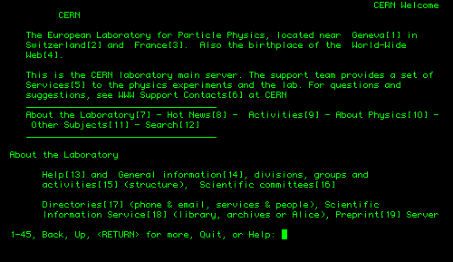

- Protocol de transaccions d’informació en format hipertext:
  - Permet la comunicació entre un client (navegador) i un servidor web.
  - Basat en el model sol·licitud-respost (request-response).
  - Hipertext: documents amb enllaços a altres documents, que permeten la navegació.
- Protocol base de l’actual web.

[Documental: the birth of Internet](https://home.cern/science/computing/birth-web)

## Protocol HTTP: descripció

- Sense estat: no té informació de connexions anteriors (necessitat cookies).
- Versions del protocol HTTP
  - 0.9 implementació original (1991)
  - 1.0 (1996)
  - 1.1 RFC 2616 (1999)
  - 2.0 RFC 7540 (2015)
  - 3.0 RFC 9114 (2022)

[Wikipedia Commons](https://es.wikipedia.org/wiki/Protocolo_de_transferencia_de_hipertexto)

- HTTP 1.1 suposa connexions permanents (s’ha de tancar la connexió). En versions anteriors el tancament era automàtic per cada enviament.

- HTTP 2.0 optimitza el trànsit web.

- HTTP 3.0 canvi de protocol TCP a UDP.

Port servidor per defecte 80 per trànsit http i 443 per https (web segur)

## HTTP/2 (RFC 7540)

Un dels principals problemes de les webs, era la la  **latència**, motivada per com estava dissenyat el protocol HTTP 1.1.

Les pàgines modernes obren múltiples connexions simultànies (Facebook n’obre 153) i el protocol clàssic les gestiona de forma independent.

Google va proposar al 2009 el protocol SPDY i IETF el va adaptar per HTTP/2.

## HTTP/2: funcionament

Se situa entre TCP i TLS amb la idea de encabir múltiples peticions sobre una sola connexió TCP.

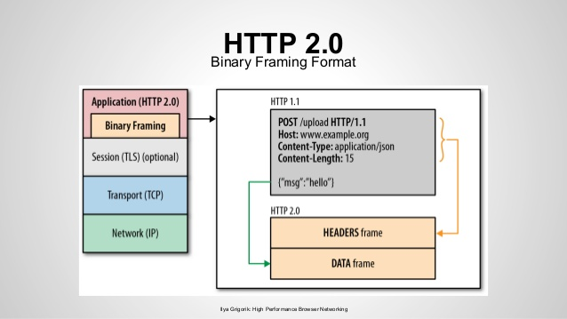

- HTTP/2 es defineix tant amb TLS com sense xifrat, però els navegadors només accepten HTTP/2 amb xifrat

- Utilitza una única connexió TCP per domini, es minimitza trànsit en evitar el 3-way handshake per cada connexió TCP.

- Permet especificar prioritats per les diferents peticions de recursos.

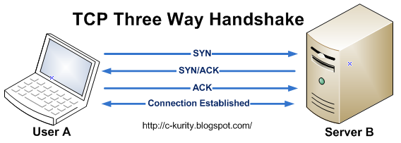

font: https://blog.cloudflare.com/es-es/http3-the-past-present-and-future-es-es/

- Comprimeix les capçaleres HTTP, reduint la quantitat de dades transmeses.

- El servidor pot enviar informació al client (PUSH) sense que el client faci la petició.

- No cal canvis a les pàgines web. Només cal que el servidor i el navegador el suportin. 

## HTTP/3 (RFC 9114)

- Aprovat el juny del 2022

- Creat a partir del protocol HTTP-over-QUIC desenvolupat per Google.

- QUIC: Quick UDP Internet Connections.

- Augment del cabal de comunicació i reducció de la latència.

- QUIC utilitza el protocol TLS 1.3 per assegurar la comunicació.

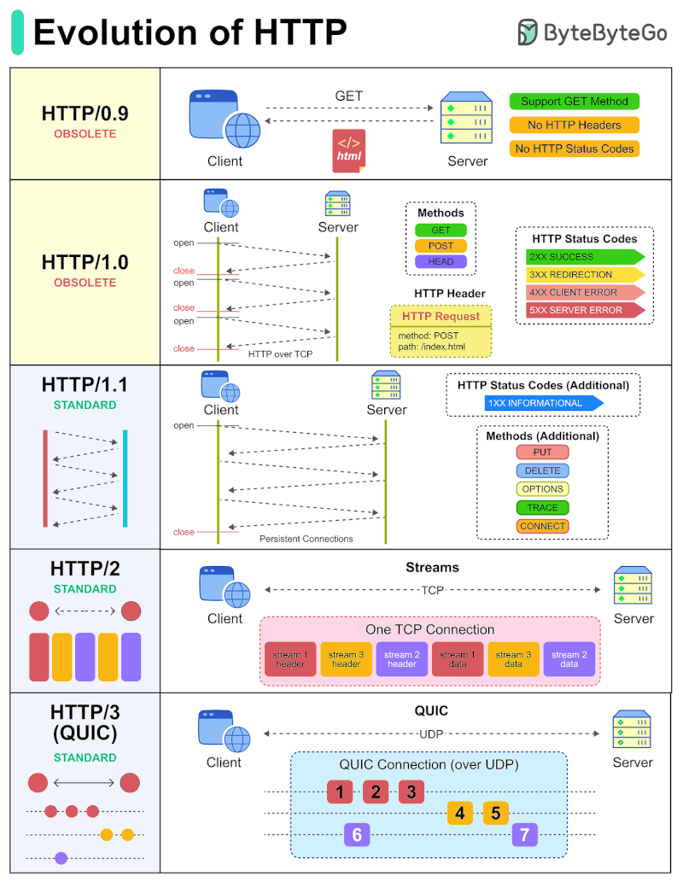

## Protocol HTTP: usos

- El protocol HTTP s’utilitza bàsicament per dos usos:

  - **pàgines web**:el servidor envia bàsicament contingut html, per tal que el navegador ho mostri per pantalla. Exemple: qualsevol pàgina web.
  - **API**: el servidor i l’aplicació client interactuen enviant-se dades i ordres. Exemple: WhatsApp.

## El client web: el navegador

El client web o navegador és una aplicació que permet visualitzar el contingut web.

Interpreta el codi HTML.

Executa les aplicacions Applet o Javascript que envia el servidor al client.

Firefox, Chrome, Safari, Internet Explorer, Edge i Opera són alguns dels navegadors més populars.

## Navegadors: orígens

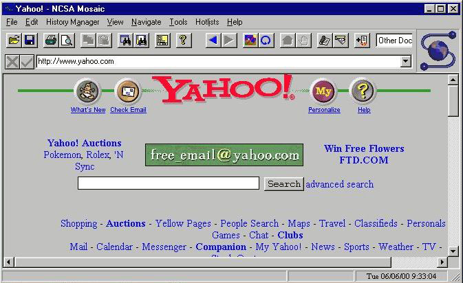

WordWideWeb per sistemes NeXT es considera el primer navegador web (1991)

Mosaic va ser el primer navegador gràfic per Windows (1993) i la base dels posteriors navegadors.

## Navegadors: actualitat

- Existeixen multitud de navegadors:
  - En entorn Windows els més populars són Chrome, Firefox, Edge i Opera.
  - En Mac Safari, Chrome i Firefox.
  - En Linux Firefox, Chromium, Lynx, Konqueror

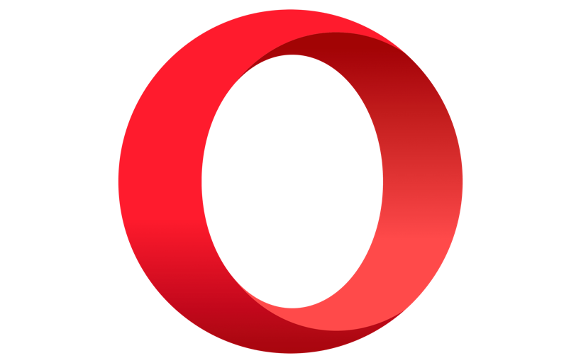

## Navegant des del terminal

- Tot i que no és el més habitual per navegar, tenim clients HTTP per terminal útils, per exemple, per descarregar arxius via web:
  - El més popular és  _[cURL](https://en.wikipedia.org/wiki/CURL)_  __. __
  - Un altra comanda Linux molt popular és  _[wget](https://en.wikipedia.org/wiki/Wget)_ .
  - A Windows tenim la comanda PowerShell  _[Invoke-WebRequest ](https://msdn.microsoft.com/powershell/reference/4.0/microsoft.powershell.utility/Invoke-WebRequest)_ –Uri tot i que accepta l’àlies curl.

Molt útils per scripts de descàrrega o necessaris per connexions a serveis web (aplicacions que usen el protocol HTTP per comunicar-se)

## Servidor web

El servidor web ha de tenir una IP coneguda per tal de permetre l’arriba de les peticions.

Quan el navegador fa una petició, utilitza el nom que identifica al servidor i al recurs (URL).

El servidor web a més de subministrar contingut estàtic (pàgines HTML) també permet l’execució de codi que proporciona dinamisme (Python, PHP, ASP, etc.)

- Els servidors més populars són:
  - Nginx
  - Apache
  - Cloudfare
  - LiteSpeed
  - IIS.

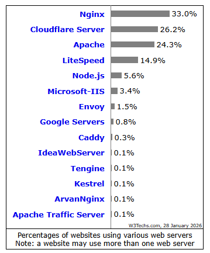

## Apache

Desenvolupat per la Apache Software Foundation.

Multiplataforma, codi obert, modular i extensible.

Molt popular en el món del hosting.

## Nginx

Servidor web lliure i de codi obert sota llicència BSD simplificada.

Multiplataforma: GNU/Linux, BSD, Solaris, Mac OS X i Windows.

Utilitzat per molts serveis grans a Internet per la seva lleugeresa i fiabilitat: WordPress, Hulu, Dropbox o Netflix.

## Cloudfare

Cloudfare és un dels CDN (Content Delivery Network) més populars.

Per aquest motiu el seu servidor apareix com el segon en el rànquing de servidors.

## LiteSpeed

Servidor propietari, propietat de LiteSpeed Tech tot i que també hi ha una variant open source.

Utilitza el mateix format de configuració que Apache i és compatible amb la majoria de mòduls.

Es caracteritza per la seva velocitat i optimització de memòria.

## Internet Information Service

Desenvolupat per Microsoft per sistemes Windows 64 bits.

Darrera versió: 10.

Inclou mòduls per ASP, ASP.NET i permet incloure PHP o Perl

Pàgina oficial  _[www.iis.net](http://www.iis.net/)_  inclou guies, extensions, etc.

## CDN

- Els CDN (content delivery network) són serveis que permeten tenir els continguts d’un servei web repartits per una xarxa de servidors mundial.
- Avantages:
  - Menor latència a l’apropar el servei als usuaris.
  - Velocitat d’accés més alta al recurs.
  - Alta disponibilitat.
- Principals actors: Akamai, Cloudfare, Amazon Cloudfront, fastly, Azure CDN.

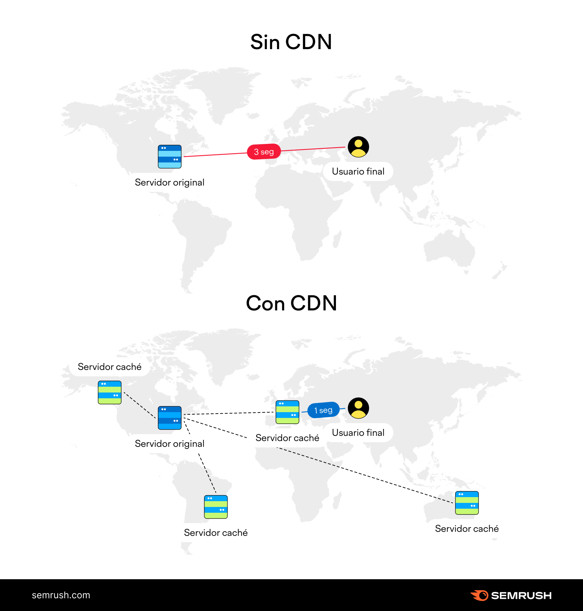

## Servidor web segur

Un servidor web és segur si garanteix la comunicació client servidor amb vinculació i confidencialitat.

El protocol TLS (anteriorment SSL).

Protocol HTTPS s’utilitza el port 443.

## SSL/TLS: descripció breu

SSL 2.0 1995 (Netscape)

Versió actual TLS 1.3 (Agost 2018).

Negociació entre client servidor.

Intercanvi claus públiques i autenticació.

Xifrat del trànsit (clau privada de sessió).

## Certificats

Arxiu que permet acreditar a un servidor o client mitjançant criptografia.

Els servidors l’utilitzen per garantir la seva identitat davant els clients.

El client també pot disposar del seu certificat amb el mateix objectiu (e-DNI, per exemple).

En la negociació del TLS s’utilitzen els certificats per l’intercanvi i autenticació.

## Certificats: Servidor

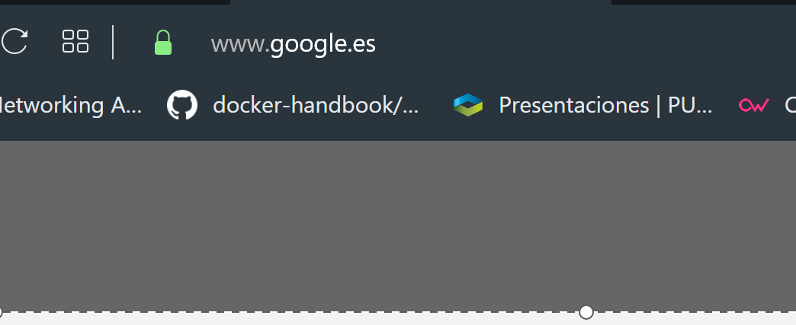

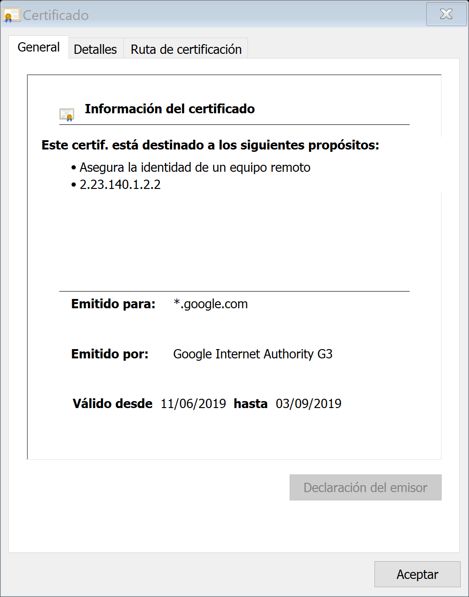

## Autoritats de certificació

Empreses o organismes que emeten certificats.

Els sistemes (navegadors) confien en les entitats de certificació i accepten els seus certificats.

Verisign (Symantec), Comodo, FNMT, CatCert...

En solucions intranet es pot crear una autoritat de certificació pròpia.

## Let’s encrypt

Iniciativa per oferir certificats gratuïts oferta pel ISRG (Internet Security Research Group).

Objectiu que tothom pugui tenir un certificat per la seva pàgina (necessari amb HTTP/2).

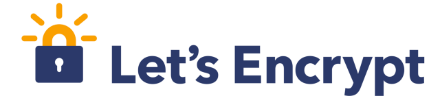

## HSTS (RFC 6797)

**HTTP Strict Transport Security**

- Protocol que obliga a que totes les comunicacions que es realitzin amb un determinat lloc web es facin via HTTPs i utilitzant un certificat vàlid.
- Això fa que si hem connectat un cop amb un domini amb un determinat certificat, si el certificat canvia, el navegador evitarà que ens connectem.
- Molt útil per evitar atacs de MitM.

## CSP (RFC 7762)

- Content Security Policy (CSP)
- Permet definir la política general de seguretat dels continguts del lloc web declarant el contingut autoritzat i el que no.
- Això permet evitar atacs de XSS, Clickjaking, etc.

**XSS** és un atac on s’injecta a les pàgines codi javascript perquè sigui executat pel client.

**Clickjacking** enganya a l’usuari perquè doni clic pensant que ho fa a un determinat lloc i realment ho fa sobre una capa invisible.

## SNI (Server Name Identification)

- Extensió del protocol TLS que serveix per identificar el domini a qui es fa la petició.
- Permet disposar de certificats pels diferents virtualhost en un mateix servidor compartint IP i port.
- Aquest identificador permet que tot i que el trànsit estigui xifrat, es pugui saber a quin domini s’està fent la petició (el SNI va sense xifrar).

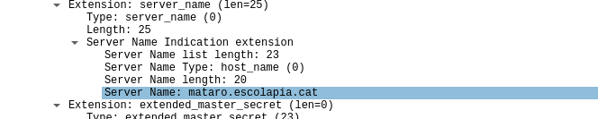

## ECH

- Encrypted Client Hello.
- Solució per evitar el problema que els operadors puguin saber via SNI a quin domini ens connectem.
- Xifra des del principi la comunicació navegador/servidor, fent inútil la inspecció del SNI.
- Tot i que encara està en revisió (draft), navegadors i hosters com Cloudfare ja el suporten.

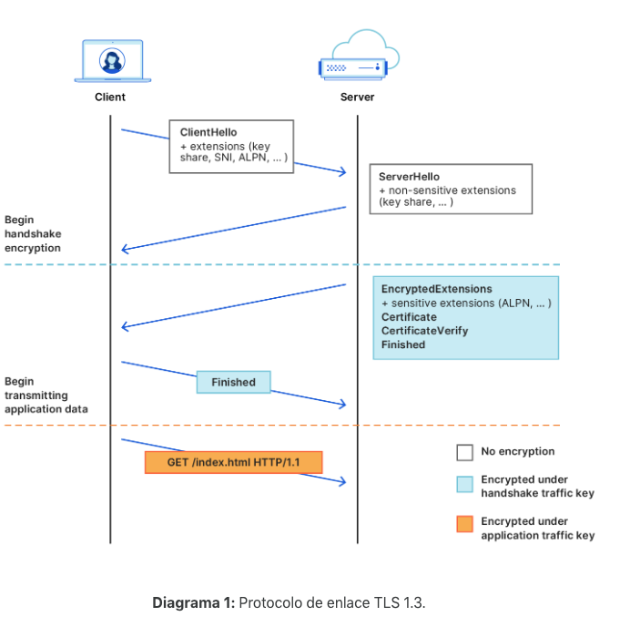

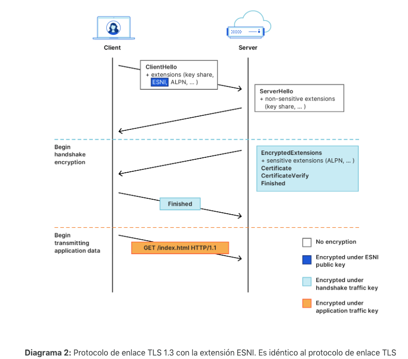

## Per saber més ...

- Hipertextual [Revista Internet]. *Historia de la Tecnología: 25 años de World Wide Web*. Març 2014. Disponible a:
  - [HTTP://hipertextual.com/2014/03/world-wide-web-25-aniversario](http://hipertextual.com/2014/03/world-wide-web-25-aniversario).
- cmarix. *8 Benefits of Content Delivery Network (CDN)*. [Blog Internet]. Maig 2016. Disponible a:
  - [https://www.cmarix.com/blog/8-benefits-of-content-delivery-network/](https://www.cmarix.com/blog/8-benefits-of-content-delivery-network/)
- Miguel Julian.  *Explicando el protocolo HTTPS.*  Genbeta [Blog Internet]. Setembre 2011. Disponible a:
  - [HTTP://www.genbeta.com/guia-de-inicio/explicando-el-protocolo-HTTPs](http://www.genbeta.com/guia-de-inicio/explicando-el-protocolo-https)
- *Introduction to Digital Certificate* . Comodo Web: [HTTPs://www.comodo.com/resources/small-business/digital-certificates-intro.php](https://www.comodo.com/resources/small-business/digital-certificates-intro.php)
- Miguel López. *SPDY, Google quiere un internet más rápido* . Genbeta [Blog Internet]. Novembre 2012. Disponible a:
  - [HTTP://www.genbeta.com/actualidad/spdy-google-quiere-un-internet-mas-rapido](http://www.genbeta.com/actualidad/spdy-google-quiere-un-internet-mas-rapido)
- J.M. Alonso.  *Google o el garante de la privacidad mundial. ¿Lo sabes?.* Un informático en el lado del mal [Blog Internet]. Desembre 2014. Disponible a:
  - [HTTP://www.elladodelmal.com/2014/12/google-o-el-garante-de-la-privacidad.html](http://www.elladodelmal.com/2014/12/google-o-el-garante-de-la-privacidad.html)
- Oscar Almarza.  *Google marcará las páginas web HTTP como ‘no seguras’ en julio* . UrbanTecno [Blog Internet]. Febrer 2018. Disponible a:
  - [https://urbantecno.com/noticia/google-marcara-las-paginas-web-http-como-no-seguras-en-julio](https://urbantecno.com/noticia/google-marcara-las-paginas-web-http-como-no-seguras-en-julio)
- C. Cimpanu. *HTTP-over-QUIC to be renamed HTTP/3*. ZDNET [Blog]. Novembre 2018. Disponible a:
  - [https://www.zdnet.com/article/http-over-quic-to-be-renamed-http3](https://www.zdnet.com/article/http-over-quic-to-be-renamed-http3)_
- T. Jarkov. *Qué Es HTTP/3 – Información Sobre el Nuevo y Rápido Protocolo Basado en UDP. Kinsta* [Blog]. Gener 2022. Disponible a:
  - [https://kinsta.com/es/blog/que-es-http3/](https://kinsta.com/es/blog/que-es-http3/)
- P. van Brouwershaven. *¿Qué es la indicación de nombre de servidor (SNI)?*. GlobalSign [Blog]. Juny 2018. Disponible a:
  - [https://www.globalsign.com/es/blog/what-is-server-name-indication](https://www.globalsign.com/es/blog/what-is-server-name-indication)
- C. Patton. *Adiós, ESNI, ¡hola, ECH!. The Cloudfare Blog* [Blog]. Desembre 2020. Disponible a:  _[https://blog.cloudflare.com/es-es/encrypted-client-hello-es-es/](https://blog.cloudflare.com/es-es/encrypted-client-hello-es-es/)

## Autoria

- Aquests materials han estat elaborats per:
  - Carlos Alonso Martínez

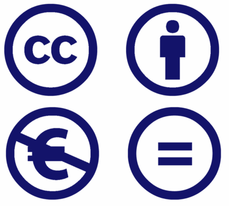

Aquesta obra està subjecta a una  _[Llicència Creative Commons Reconeixement-NoComercial-CompartirIgual 4.0 Internacional](https://creativecommons.org/licenses/by-nc-sa/4.0/deed.ca).